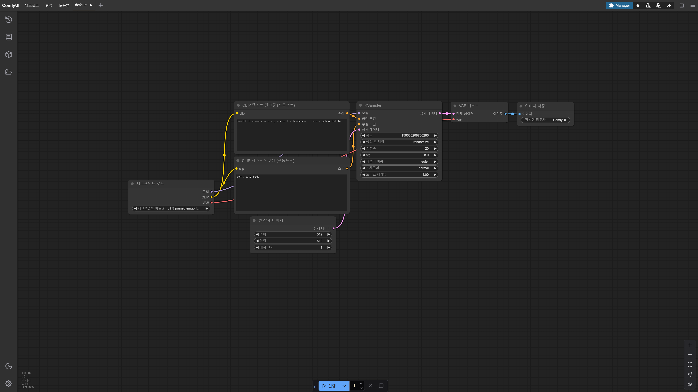
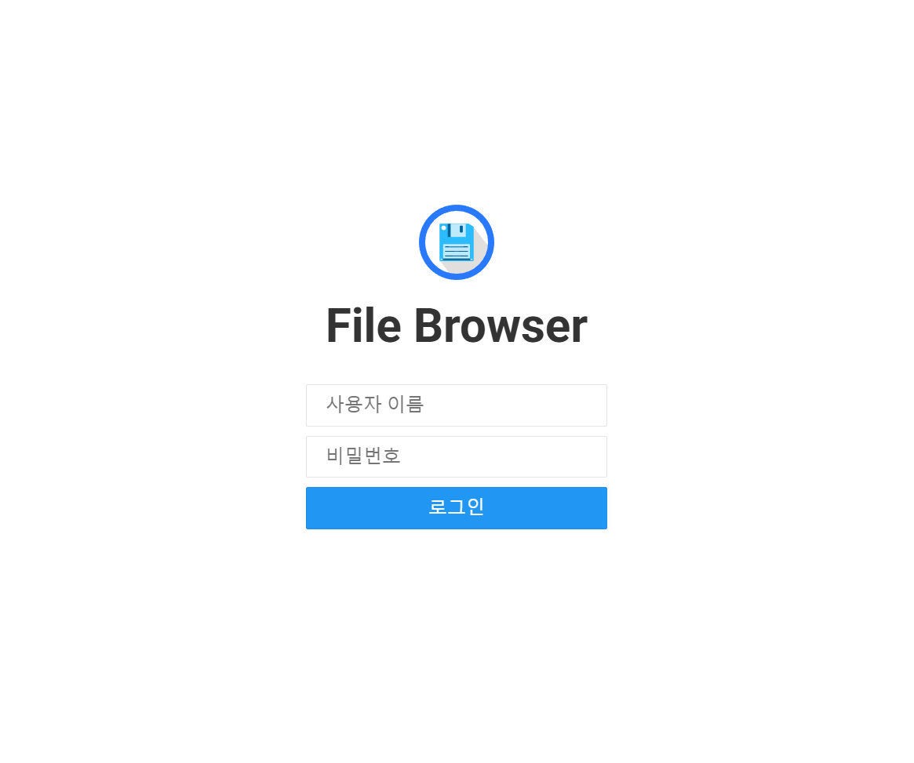

# ComfyUI Helm Chart

This repository contains a simple Helm chart for deploying **ComfyUI** and **FileBrowser**.

## Docker Image

This chart uses the Docker image based on [YanWenKun/ComfyUI-Docker](https://github.com/YanWenKun/ComfyUI-Docker).

## Overview

The goal of this chart is to provide a straightforward way to deploy ComfyUI and its auxiliary services using Helm.

## Features

- Easy deployment of **ComfyUI**
- Optional deployment of **FileBrowser** for file management
- Persistent storage support
- Ingress support for external access
- Support for extra Kubernetes objects via `extraObjects`

## TODO

- ~~Add functionality for model integration.~~
- ~~Add support for custom node additions.~~

## FileBrowser Access

If you enable `filebrowser.enabled` in `values.yaml`, you can access FileBrowser at:

```
https://<your-domain>/<baseurl>
```

For example:
```
https://comfyui.example.com/file
```

By default, FileBrowser will start **without any user authentication**.

It is strongly recommended to:

1. **Immediately create an admin account** after first access.
   * ID/PASSWORD: `admin`/`admin`
2. Or configure an authentication proxy (OAuth2 Proxy, Basic Auth) via Ingress annotations.

## Example Screenshots

When you access **ComfyUI**:



When you access **FileBrowser**:



## Notes

- FileBrowser initial account setup has been intentionally removed for flexibility.
- If you want to enforce authentication, please configure it separately.
- Additional Kubernetes objects can be injected via `extraObjects` in `values.yaml`.
